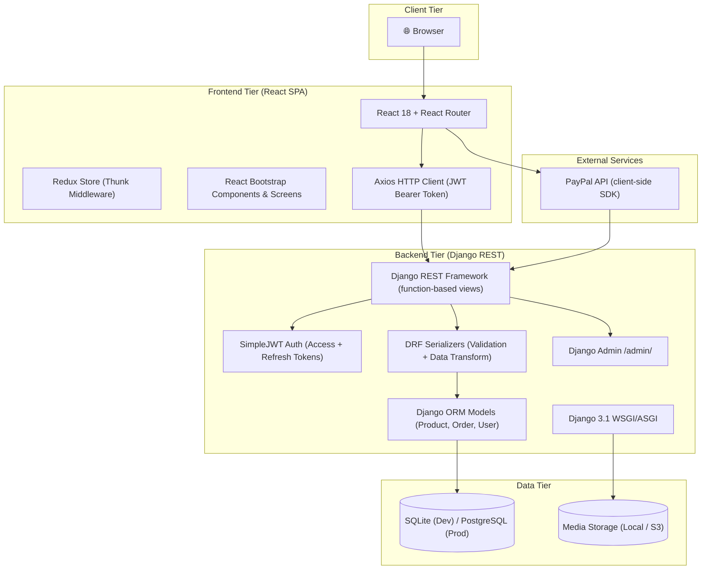
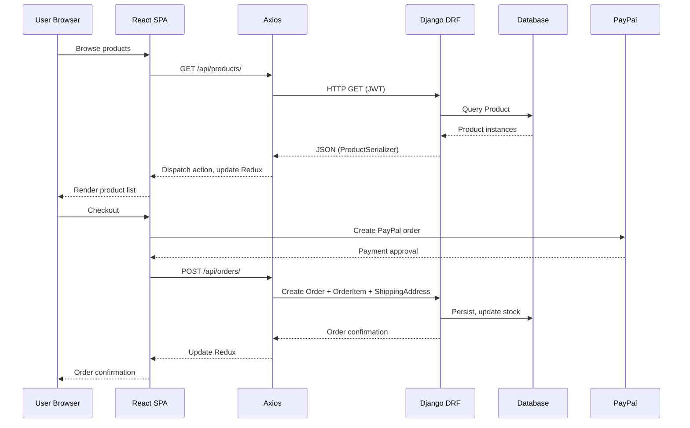

# Ecom — System Architecture Blueprint

> **Project:** ecom — Django + React Ecommerce Platform  
> **Generated:** 2026-07-24  
> **Mirror of:** `../ecom_architecture.md`

---

## 1. High-Level Architecture

Ecom is a **dual-stack** ecommerce platform: a Django REST Framework backend serves a React SPA frontend via RESTful JSON APIs.

---

## 2. Request Lifecycle

---

## 3. Key Architectural Decisions

| Decision | Rationale |
|----------|-----------|
| Separate frontend/backend | Independent dev cycles, clear API contract |
| Function-based DRF views | Simpler than ViewSets for this scale |
| Redux + Thunk (not Toolkit) | Classic Redux — mature, well-understood |
| HashRouter | Avoids server-side URL handling for SPA |
| SimpleJWT 30d tokens | Pragmatic — users stay logged in |
| SQLite dev → PostgreSQL prod | Zero-config dev, production-grade persistence |
| PayPal client-side SDK | Tokenization by PayPal; backend verifies |

---

## 4. Backend Models

| Model | Fields | Relationships |
|-------|--------|--------------|
| **Product** | `_id`, `name`, `image`, `brand`, `category`, `description`, `rating`, `numReviews`, `price`, `countInStock`, `createdAt` | FK → User (seller) |
| **Review** | `_id`, `name`, `rating`, `comment`, `createdAt` | FK → Product, FK → User |
| **Order** | `_id`, `paymentMethod`, `taxPrice`, `shippingPrice`, `totalPrice`, `isPaid`, `paidAt`, `isDelivered`, `deliveredAt`, `createdAt` | FK → User |
| **OrderItem** | `_id`, `name`, `qty`, `price`, `image` | FK → Product, FK → Order |
| **ShippingAddress** | `_id`, `address`, `city`, `postalCode`, `country`, `shippingPrice` | OneToOne → Order |
